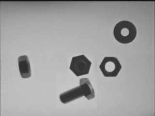
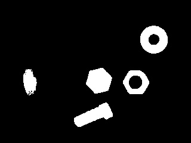

# Object Classification

## Overview

## 1. Preprocess Image 

### Smooth image
In this project, I'm using medianBlue(). Though, note that there are 4 different ways to smooth images to remove noise using OpenCV:
- blur()
- medianBlur()
- GaussianBlur()
- bilaternalBlur()

The difference betwwen these methods is the filter kernel applied to the original image. Each one has different advantage and use case.

After remove noise:

### Remove Background

Remove background: division
- same pixel: value close to 1
- different pixel: value from 0 to 1 (because black is 0 and white is 1 so the difference between dark objects and light background is between 0 and 1)

The more different, the smaller the value. W want the most different to be prominent pixel. Hence, ``1 - (I / L)``. Then times 255 to get to the original pixel.

After remove background:

### Thresholding

After appplying threshold algorithm:

